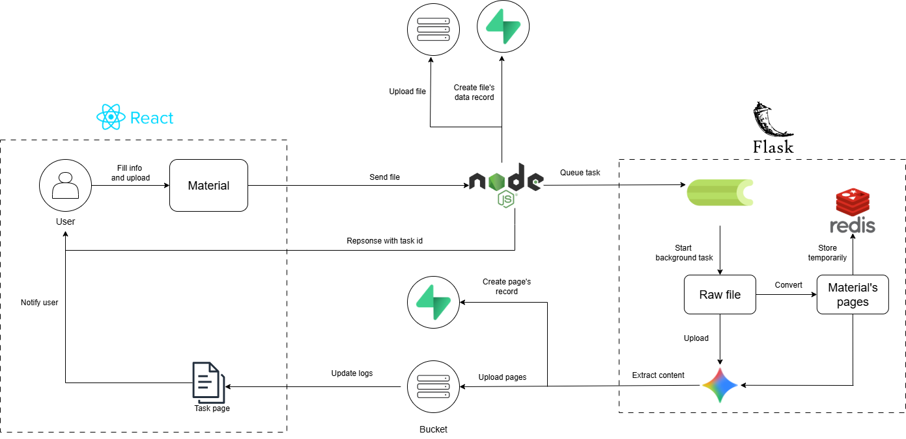
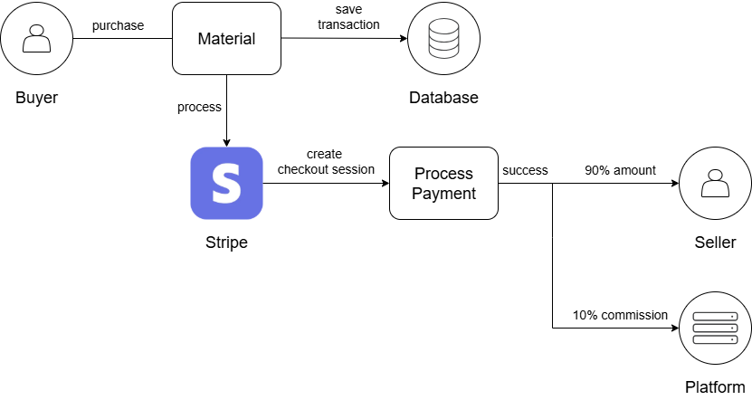
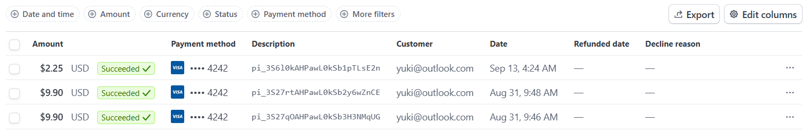

# StudyShare - Educational Document Sharing Platform

## 1. Project Overview

StudyShare is a modern, full-stack web application designed as an educational document sharing platform, similar to Studocu. The platform enables students to upload, share, and access academic materials while leveraging AI-powered features for enhanced learning experiences. Built with a microservices architecture, the application ensures scalability, maintainability, and high performance.

## 2. Key Features
### 2.1. User Authorization
Allow basic user registration and login or via Google OAuth 2.0 (via Passport.js). The flow process is as follows:

- User selects authentication method (Regular or Google OAuth).
  
- For Regular Auth: User fills out registration/login form. For Google OAuth: User is redirected to Google's OAuth consent screen.
  
- Upon successful authentication, user data is stored in the database, and a JWT token is generated for session management.
  
- Protected routes use middleware to validate JWT tokens on each request.
  
- Frontend implements Google OAuth button/link, popup or redirect-based authentication, token storage and management, and automatic login state management.
  
The following table summarizes the differences between Regular Auth and Google OAuth:

| Feature | Regular Auth | Google OAuth |
|---------|--------------|--------------|
| Registration | Manual form submission | Pre-verified by Google |
| Email Verification | Requires email confirmation | Pre-verified by Google |
| Password Management | User-managed passwords | OAuth token-based |
| User Data | User-provided information | Google profile information |
| Security | Password hashing and validation | OAuth 2.0 security protocols |

### 2.2. Material Upload with AI Summarization
Enable users to upload educational documents (PDF, DOCX) and automatically generate AI-based summaries using Gemini 2.5 Pro API. The summarization process is handled in background jobs to ensure responsiveness. The process is as follows:

- User uploads a material and provides metadata (title, description, subject, etc.).
  
- The data is added to the database using Nodejs backend, and a background job is triggered to process the document using Flask microservice.
  
- The background job is queued using Celery and Redis to handle asynchronous processing. The job can be described as follows:
    - The document is splitted into pages. It's images are stored temporarily in Redis to make it easier for the AI model to process them. User can check the task log in the frontend to see the progress of the job.
  
    - All pages are sent to AI model to generate a detailed summary of the document. The summary is stored in the database so that every time a user asks for the material's content, the AI model can use the summary to generate a more accurate response and doesn't need to process the whole document again.
  
    - The pages are then uploaded to Supbase Bucket for storage, their URLs are stored in the database, identified by the document ID. The original material file is also stored in Supbase Bucket and its URL is saved in the database.
  
    - Once the job is completed, user can access the material's page to view the summary and download the original file. Whenever a user views the material's page, the backend will create a chat session with the content of the document so that user can ask questions about the document. When the user leaves the page, the chat session will be deleted to save resources.
  
    - The pages displayed in the material's page are loaded from Supbase Bucket using loading-on-scroll technique. This ensures that the page loads quickly and only the necessary data is fetched from the server.
  
        

### 2.3. Payment Integration
Implement Stripe payment gateway for selling and purchasing premium documents. The payment flows are implemented as follows:

- Buyer initiates purchase of a material and enters Stripe checkout page.
  
- Platform creates Stripe checkout session with application fee and transfer data (product details, buyer and seller info, etc.).
  
- Stripe processes the payment from the buyer's card. Platform takes a 10% commission, and the remaining amount is transferred directly to the seller's Stripe account. No manual transfer of funds is required.

    

- Seller checks their Stripe dashboard to see the received payment.

    
    
### 2.5. Search and Filter
Implement advanced search functionality with filters based on document type, subject, and popularity.