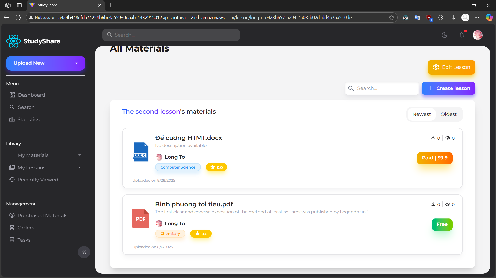

# StudyShare - Educational Document Sharing Platform

## 1. Project Overview

StudyShare is a modern, full-stack web application designed as an educational document sharing platform, similar to Studocu. The platform enables students to upload, share, and access academic materials while leveraging AI-powered features for enhanced learning experiences. Built with a microservices architecture, the application ensures scalability, maintainability, and high performance.


## 2. Key Features
### 2.1. User Authorization
Allow basic user registration and login or via Google OAuth 2.0 (via Passport.js). The flow process is as follows:

- User selects authentication method (Regular or Google OAuth).
  
- For Regular Auth: User fills out registration/login form. For Google OAuth: User is redirected to Google's OAuth consent screen.
  
- Upon successful authentication, user data is stored in the database, and a JWT token is generated for session management.
  
- Protected routes use middleware to validate JWT tokens on each request.
  
- Frontend implements Google OAuth button/link, popup or redirect-based authentication, token storage and management, and automatic login state management.
  
The following table summarizes the differences between Regular Auth and Google OAuth:

| Feature | Regular Auth | Google OAuth |
|---------|--------------|--------------|
| Registration | Manual form submission | Pre-verified by Google |
| Email Verification | Requires email confirmation | Pre-verified by Google |
| Password Management | User-managed passwords | OAuth token-based |
| User Data | User-provided information | Google profile information |
| Security | Password hashing and validation | OAuth 2.0 security protocols |

### 2.2. Material Upload with AI Summarization
Enable users to upload educational documents (PDF, DOCX) and automatically generate AI-based summaries using Gemini 2.5 Pro API. The summarization process is handled in background jobs to ensure responsiveness. The process is as follows:

- User uploads a material and provides metadata (title, description, subject, etc.).
  
- The data is added to the database using Nodejs backend, and a background job is triggered to process the document using Flask microservice.
  
- The background job is queued using Celery and Redis to handle asynchronous processing. The job can be described as follows:
    - The document is splitted into pages. It's images are stored temporarily in Redis to make it easier for the AI model to process them. User can check the task log in the frontend to see the progress of the job.
  
    - All pages are sent to AI model to generate a detailed summary of the document. The summary is stored in the database so that every time a user asks for the material's content, the AI model can use the summary to generate a more accurate response and doesn't need to process the whole document again.
  
    - The pages are then uploaded to Supbase Bucket for storage, their URLs are stored in the database, identified by the document ID. The original material file is also stored in Supbase Bucket and its URL is saved in the database.
  
    - Once the job is completed, user can access the material's page to view the summary and download the original file. Whenever a user views the material's page, the backend will create a chat session with the content of the document so that user can ask questions about the document. When the user leaves the page, the chat session will be deleted to save resources.
  
    - The pages displayed in the material's page are loaded from Supbase Bucket using loading-on-scroll technique. This ensures that the page loads quickly and only the necessary data is fetched from the server.
  
        

### 2.3. Payment Integration
Implement Stripe payment gateway for selling and purchasing premium documents. The payment flows are implemented as follows:

- Buyer initiates purchase of a material and enters Stripe checkout page.
  
- Platform creates Stripe checkout session with application fee and transfer data (product details, buyer and seller info, etc.).
  
- Stripe processes the payment from the buyer's card. Platform takes a 10% commission, and the remaining amount is transferred directly to the seller's Stripe account. No manual transfer of funds is required.

    

- Seller checks their Stripe dashboard to see the received payment.

    
    
### 2.5. OTP Verification
Implement OTP verification for sensitive actions like password reset and email change. The OTP verification process is as follows:

- User requests OTP for a specific action (e.g., password reset).

- System generates a secure OTP and sends it to the user's registered email address using an email service. This task is handled in background jobs using `node-cron` to ensure timely delivery.
  
- User receives the OTP and enters it on the verification page.
  
- System validates the entered OTP against the generated one, checking for correctness and expiration.
  
- Upon successful verification, the user is allowed to proceed with the requested action (e.g., resetting the password).

### 2.5. AI-Powered Chatbot
Integrate an AI-powered chatbot using **Gemini 2.5 Pro API** to assist users with document-related queries. The chatbot functionality is implemented as follows:

- User accesses the chatbot interface on the material's page.
  
- User inputs questions or queries related to the document.
  
- In the first time a user opens the material's page, the backend creates a chat session with the content of the document, including its AI-generated summary. This ensures that the chatbot has context about the document.
  
- The chatbot processes the user's input and generates responses based on the document's content and summary.
  
- The chatbot displays the responses in a conversational format, allowing users to interactively ask follow-up questions.
  
- When the user leaves the material's page, the chat session is deleted to save resources.

### 2.6. Statistics Dashboard
Provide a comprehensive statistics dashboard for users to view our platform's performance metrics. The dashboard includes:
- Total number of materials uploaded
- Total number of lessons created
- Total number of users registered
- Total number of materials downloaded
- Rankings of top 5 materials based on downloads/views
- Rankings of top 5 users based on materials uploaded

## 3. Page Structure
The application consists of the following main pages:
### 3.1. User Profile Page
View and manage user profile details, including uploaded materials, created lessons, and account settings.


### 3.2. Signup Page
User registration interface with options for regular and Google OAuth authentication.


### 3.3. Login Page
User login interface with options for regular and Google OAuth authentication.


### 3.4. Upload Page
Upload new educational documents with metadata.


### 3.5. Material View Page
View material pages (premium materials require purchase to view all pages or download), download original file, rate and comment on materials, and interact with the AI chatbot.


### 3.6. Material Edit Page
Edit existing materials (only for the uploader).


### 3.7. Lesson View Page
View lesson details and associated materials.



### 3.8. Lesson Edit Page
Edit existing lessons (only for the creator).


### 3.9. Statistics Dashboard Page
View platform performance metrics and rankings.

  
  

### 3.10. Account Settings Page
Manage user profile details, change password, and update email.


### 3.11. Create Lesson Page
Create and manage lessons, including associating materials.


### 3.12. History Page
View the list of materials the user has viewed.


### 3.13. User's Materials Page
Browse materials uploaded by a specific user.


### 3.14. User's Lessons Page
Browse lessons created by a specific user.


### 3.15. Orders Page
View the user's purchase history.


### 3.16. Payment Page
View payment history for materials sold by the user.


### 3.17. Search Page
Search for materials and lessons with advanced filters.


### 3.18. Tasks Page
View logs and status of background jobs for material processing.


## 4. Database Schema


The database schema is designed to support the application's features and ensure data integrity. The main tables are grouped by functionality:

### 4.1. User Management
- **User**: Manages user accounts, authentication, and profile information for both regular and Google OAuth users

### 4.2. Content Management
- **Material**: Stores educational documents with metadata, pricing, and access control
- **MaterialPage**: Stores URLs for individual pages of processed documents for optimized loading
- **MaterialSummary**: Contains AI-generated summaries for each document to enhance chatbot interactions
- **Subject**: Categorizes materials by academic subjects for better organization

### 4.3. Learning Organization
- **Lesson**: Groups related materials into structured learning units or courses
  
### 4.4. User Interaction
- **Comment**: Enables user feedback and discussions on educational materials
- **Rating**: Tracks user ratings for materials to build reputation and quality metrics
- **RatingLog**: Prevents duplicate ratings and maintains rating integrity
- **Upvote**: Tracks comment popularity through user voting system

### 4.5. Activity Tracking
- **History**: Records user viewing history for personalized recommendations and analytics
- **Task**: Monitors background job processing status for document analysis and AI tasks

### 4.6. Financial Transactions
- **Payment**: Records financial transactions for premium content purchases through Stripe integration

## 5. Pipeline Workflow
### 5.1. Development Environment
- **Frontend**: React with TypeScript, Redux Toolkit for state management, React Router DOM for navigation, and Tailwind CSS for styling.
- **Node.js Backend**: Express with ES Modules for RESTful API, JWT authentication, and business logic.
- **Flask Backend**: Python Flask with Celery for AI-related tasks and asynchronous document processing.
- **Database**: PostgreSQL managed via Supabase with real-time capabilities.
- **File Storage**: Supabase Storage buckets for uploaded documents, processed images, and user assets.
- **Message Queue**: Redis for Celery task queuing and temporary data storage.
- **AI Integration**: Google Generative AI (Gemini 2.5 Pro) for document summarization and chatbot functionality.

### 5.2. Jenkins Automation
- **Source Webhook**: Trigger builds on code push to the main branch.
- **Jenkins**: CI/CD server to automate build, test, and deployment processes.
  
### 5.3. Build & Containerization
- **Docker**: Multi-stage builds for optimized container images
  - Frontend: Node.js build environment with Vite bundler. Nginx is used to serve the built static files.
  - Node.js Backend: Alpine Linux base for lightweight production images
  - Flask Backend: Python slim image with required dependencies
  - Celery Worker: Separate container for background job processing
  - Redis: Official Redis image for message brokering
- **Container Registry**: Docker images stored and versioned for deployment
- **Environment Configuration**: Separate environment files for development, staging, and production

### 5.5. Testing Strategy
- **Frontend Testing**: 
  - Unit Tests: Vitest and React Testing Library
  - Component Testing: Material-UI component integration tests
  - State Management: Redux store and action testing
- **Node.js Backend Testing**: 
  - Unit Tests: Jest framework with Supertest for HTTP endpoint testing
  - Integration Tests: Database operations and external API integrations
  - Authentication Tests: JWT token validation and OAuth flow testing

### 5.5. Deployment Infrastructure
- **Container Orchestration**: Self-managed Kubernetes cluster on AWS EC2 instances
- **Cloud Integration**: 
  - AWS Cloud Controller Manager for external IP exposure and cloud service integration
  - AWS Load Balancer Controller for automatic ELB provisioning and management
- **Load Balancing**: 
  - AWS Application Load Balancer (ALB) for external traffic distribution
  - NGINX Ingress Controller for internal service routing and SSL termination
- **Service Discovery**: Kubernetes native service discovery with DNS resolution

### 5.6. Monitoring & Observability
- **Metrics Collection**: 
  - Prometheus for metrics aggregation from all services
  - Node.js: prom-client for custom application metrics
  - Flask: prometheus_flask_exporter for Python service metrics
- **Visualization**: Grafana dashboards for real-time monitoring and alerting
- **Health Checks**: Kubernetes liveness and readiness probes for service health monitoring
- **Log Aggregation**: Centralized logging for debugging and audit trails

## 6. Directory Structure
The project follows a modular directory structure to separate concerns and enhance maintainability:

```
StudyShare/
├── README.md                           # Project documentation
├── TREE.md                             # Directory detailed structure
├── docker-compose.yml                  # Local development orchestration
├── .gitignore                          # Git ignore rules
├── Jenkinsfile                         # Jenkins CI/CD pipeline configuration 
│
├── frontend/                           # React TypeScript Frontend
│   ├── public/                         # Static assets
│   ├── dist/                           # Built frontend files
│   ├── src/                            # Source code
│   │   ├── assets/                     # Static assets (images, fonts, etc.)
│   │   ├── components/                 # Reusable React components
│   │   │   ├── common/                 # Shared components
│   │   │   ├── layout/                 # Shared layout components (Header, Footer, Sidebar)
│   │   ├── interfaces/                 # TypeScript type definitions
│   │   ├── constants/                  # Application constants
│   │   ├── pages/                      # Page components
│   │   │   ├── AccountSettingsPage/
│   │   │   │   ├── components/         # Sub-components for Account Settings
│   │   │   │   ├── layouts/            # Layout components for Account Settings
│   │   │   │   ├── images/             # Images used in Account Settings
│   │   │   │   └── AccountSettingsPage.tsx # Main Account Settings Page component
│   │   │   ├── CreateLessonPage/
│   │   │   ├── HistoryPage/
│   │   │   └── [Other pages...]
│   │   ├── redux/                     # Redux state management
│   │   ├── services/                  # API service functions
│   │   ├── utils/                     # Utility functions
│   │   ├── styles/                    # Global styles
│   │   ├── App.tsx                    # Main application component
│   │   ├── main.tsx                   # Application entry point
│   │   └── vite-env.d.ts              # Vite environment types
│   ├── tests/                         # Frontend test files
│   │   ├── AccountSettingPage/        # Account Settings Page tests
│   │   ├── [Other page tests...]
│   │   └── setup.ts                   # Test configuration
│   ├── .react.env                     # React environment variables
│   ├── Dockerfile                     # Frontend container configuration
│   ├── entrypoint.sh                  # Nginx entrypoint script
│   ├── eslint.config.js               # ESLint configuration
│   ├── index.html                     # HTML template
│   ├── nginx.conf                     # Nginx configuration
│   ├── package.json                   # Frontend dependencies
│   ├── tailwind.config.js             # Tailwind CSS configuration
│   ├── tsconfig.json                  # TypeScript configuration
│   ├── vite.config.ts                 # Vite configuration
│   └── vitest.config.ts               # Vitest configuration
│
├── backend/                           # Backend services
│   ├── node/                          # Node.js Express Backend
│   │   ├── config/                    # Configuration files for services
│   │   ├── constants/                 # Application constants
│   │   ├── controllers/               # Request handlers
│   │   ├── middleware/                # Express middleware
│   │   ├── models/                    # Database models
│   │   ├── routes/                    # API route definitions
│   │   ├── services/                  # Business logic
│   │   ├── tests/                     # Node.js backend tests
│   │   ├── uploads/                   # Temporary file storage
│   │   ├── utils/                     # Utility functions
│   │   ├── Dockerfile                 # Node.js container configuration
│   │   ├── .node.env                  # Node.js environment variables
│   │   └── server.js                  # Main server entry point
│   │
│   └── flask/                         # Python Flask Backend
│       ├── app/                       # Flask application
│       │   ├── __init__.py            # Flask app initialization
│       │   ├── routes.py              # Flask route definitions
│       │   ├── config/                # Flask configuration
│       │   ├── constants/             # Flask constants
│       │   ├── models/                # Flask data models
│       │   └── services/              # Flask services
│       ├── instance/                  # Flask instance folder
│       ├── output_pdf/                # Processed PDF output
│       ├── output_webp/               # Converted image output
│       ├── uploads/                   # Temporary upload storage
│       ├── .dockerignore              # Docker ignore rules
│       ├── .flask.env                 # Flask environment variables
│       ├── wsgi.py                    # WSGI application entry point
│       ├── requirements.txt           # Python dependencies
│       ├── .gitignore                 # Git ignore rules
│       └── Dockerfile                 # Flask container configuration
│
├── database/                          # Database schema file
│
├── k8s/                               # Kubernetes deployment manifests
│   ├── deployments/                   # Application deployments
│   ├── services/                      # Kubernetes services
│   └── ingress/                       # Ingress configurations
│
├── grafana/                           # Monitoring configurations
│
├── images/                            # Documentation images
│   └── pages/                         # Page screenshots
│
└── scripts/                           # Utility scripts
```

The complete directory structure is documented in `TREE.md`.

## 7. Technology Stack

### 7.1. Frontend Technologies

#### Core Framework & Language
| Technology | Version | Purpose |
|------------|---------|---------|
| React | 19.1.0 | Main UI framework |
| TypeScript | 5.8.3 | Type-safe development |
| Vite | 7.0.4 | Build tool and dev server |

#### Styling & UI Components
| Technology | Version | Purpose |
|------------|---------|---------|
| Tailwind CSS | 4.1.11 | Utility-first CSS framework |
| Material-UI (MUI) | 7.2.0 | React component library |
| Emotion | 11.14.0 | CSS-in-JS styling |

#### State Management & Routing
| Technology | Version | Purpose |
|------------|---------|---------|
| Redux Toolkit | 2.8.2 | State management |
| React Redux | 9.2.0 | React-Redux integration |
| React Router DOM | 7.6.3 | Client-side routing |

#### Additional Frontend Libraries
| Technology | Version | Purpose |
|------------|---------|---------|
| React Markdown | 10.1.0 | Markdown content rendering |
| Google OAuth | 0.12.2 | Social authentication |
| Stripe.js | 7.9.0 | Payment processing integration |
| UUID | 11.1.0 | Unique identifier generation |

### 7.2. Backend Technologies

#### Node.js Backend Service
| Technology | Version | Purpose |
|------------|---------|---------|
| Express | 5.1.0 | Web application framework |
| Node.js | Latest | JavaScript runtime |

#### Python Flask Backend Service
| Technology | Version | Purpose |
|------------|---------|---------|
| Flask | Latest | Lightweight web framework |
| Celery | Latest | Distributed task queue |
| Gunicorn | Latest | WSGI HTTP server |

#### Authentication & Security
| Technology | Version | Purpose |
|------------|---------|---------|
| JSON Web Tokens (JWT) | 9.0.2 | Token-based authentication |
| Passport.js | 0.7.0 | Authentication middleware |
| Google OAuth 2.0 | Latest | Social login integration |
| bcrypt | 6.0.0 | Password hashing and security |

#### Database & Storage Solutions
| Technology | Version | Purpose |
|------------|---------|---------|
| Supabase | Latest | Backend-as-a-Service platform |
| PostgreSQL | Latest | Primary relational database |
| Redis | 5.8.2 | Caching and session management |

#### AI & Machine Learning Integration
| Technology | Version | Purpose |
|------------|---------|---------|
| Google Generative AI (Gemini) | 1.16.0 | AI-powered content analysis and generation |

#### File Processing Capabilities
| Technology | Version | Purpose |
|------------|---------|---------|
| Multer | 2.0.2 | File upload handling |
| Sharp | 0.34.3 | Image processing and optimization |
| pdf2image | Latest | PDF to image conversion |
| docx2pdf | Latest | Word document to PDF conversion |

#### External Services Integration
| Technology | Version | Purpose |
|------------|---------|---------|
| Stripe | 18.5.0 | Payment gateway and subscription management |
| Nodemailer | 7.0.6 | Email service integration |
| Node-cron | 4.2.1 | Task scheduling and automation |

### 7.3. DevOps & Infrastructure

#### Containerization & Orchestration
| Technology | Version | Purpose |
|------------|---------|---------|
| Docker | Latest | Application containerization |
| Docker Compose | Latest | Multi-container development |
| Kubernetes | Latest | Production orchestration (manually installed) |
| AWS Cloud Controller Manager | Latest | External IP exposure and cloud integration |
| AWS Load Balancer Controller | Latest | AWS ELB integration for load balancing |
| NGINX Ingress | Latest | Application-level routing and traffic management |

#### CI/CD & Development Tools
| Technology | Version | Purpose |
|------------|---------|---------|
| Jenkins | Latest | Continuous integration and deployment |
| Git | Latest | Version control and collaboration |
| WSL | Latest | Windows development environment |

#### Monitoring & Observability
| Technology | Version | Purpose |
|------------|---------|---------|
| Prometheus | Latest | Metrics collection and monitoring |
| Grafana | Latest | Data visualization and dashboards |
| prometheus_flask_exporter | Latest | Flask application metrics |
| prom-client | 15.1.3 | Node.js application metrics |

#### Testing Frameworks
| Technology | Version | Purpose |
|------------|---------|---------|
| Vitest | Latest | Frontend unit testing |
| Jest | 30.1.3 | Backend JavaScript testing |
| Testing Library | Latest | React component testing |
| Supertest | 7.1.4 | HTTP endpoint testing |

## 8. License
This project is licensed under the MIT License. See the [LICENSE](LICENSE) file for details.